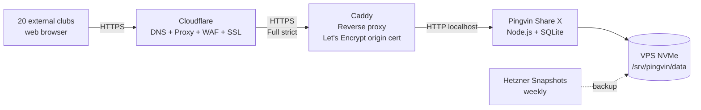

# Multikulti Upload Platform

A self-hosted file-upload portal for collecting audio files (MP3/WAV) from
external dance/singing clubs performing at our events.

- **Stack**: [Pingvin Share X](https://github.com/stonith404/pingvin-share) + Caddy + Docker, deployed on a Hetzner Cloud VPS, fronted by Cloudflare.
- **Cost**: ~€5/month (Hetzner CX22 €4.49 + Hetzner snapshots ~€0.50). Cloudflare DNS is free.
- **Provisioning**: Fully automated via Terraform. One-command deploy, one-command teardown.

## Why this design

Each performing club gets a unique **reverse-share link** (Pingvin's built-in
feature: an upload-only URL that drops files into an isolated bucket). Clubs
don't need accounts, don't see each other's uploads, and don't need any
technical knowledge — just drag-and-drop into a clean web UI.

The admin (you) creates the reverse-share links from Pingvin's admin panel
and emails them to each club along with a PIN.

## Architecture



See [docs/architecture.md](docs/architecture.md) for more diagrams (event
lifecycle, network flow).

## Quick start (TL;DR)

```bash
# 1. Install prerequisites: terraform, hcloud, ssh
# 2. Get API tokens (see docs/01-prerequisites.md):
#    - Hetzner Cloud project token
#    - Cloudflare API token (Zone:DNS:Edit on kud-mladost.org)
# 3. Configure
cd terraform
cp terraform.tfvars.example terraform.tfvars
$EDITOR terraform.tfvars       # paste tokens + adjust values

# 4. Deploy
terraform init
terraform apply

# 5. Wait ~3 minutes for cloud-init to finish, then visit:
#    https://multikulti-2026.kud-mladost.org
#    The first visitor (you) is prompted to create the admin account.
```

For the long-form, "I'm reading this in 2027 and forgot everything" version,
start at [docs/01-prerequisites.md](docs/01-prerequisites.md).

## Repository layout

```
.
├── README.md                       # This file
├── docs/
│   ├── 01-prerequisites.md         # Accounts, tokens, local tools
│   ├── 02-initial-setup.md         # Step-by-step first deploy
│   ├── 03-event-operations.md      # Per-event admin runbook
│   ├── 04-maintenance.md           # Updates, snapshots, restore
│   ├── 05-teardown-and-restore.md  # Pause between events to save money
│   ├── 06-troubleshooting.md       # Common issues + fixes
│   ├── architecture.md             # Mermaid diagrams
│   ├── onboarding-helper.md        # One-pager for a non-technical club helper
│   └── deploy-log.md               # Running record of what's deployed
├── terraform/
│   ├── main.tf                     # Hetzner server, firewall, SSH key, Cloudflare DNS
│   ├── variables.tf
│   ├── outputs.tf
│   ├── versions.tf                 # Provider pins
│   ├── cloud-init.yaml.tftpl       # Server bootstrap (Docker, Caddy, Pingvin)
│   └── terraform.tfvars.example    # Template — copy to terraform.tfvars
├── stack/
│   ├── docker-compose.yml          # Caddy + Pingvin (rendered onto the VPS)
│   └── Caddyfile                   # Reverse proxy (rendered onto the VPS)
├── scripts/
│   ├── update.sh                   # docker compose pull && up -d on the VPS
│   ├── backup.sh                   # Optional: restic backup helper
│   └── restore.sh
├── .gitignore
└── LICENSE
```

## Costs

| Item | Monthly |
|---|---|
| Hetzner CX22 (2 vCPU, 4 GB RAM, 40 GB NVMe, 20 TB traffic, Falkenstein) | €4.49 |
| Hetzner weekly snapshot (~40 GB) | ~€0.50 |
| Cloudflare DNS + proxy + WAF | €0 |
| Domain `kud-mladost.org` (existing) | — |
| SMTP (Brevo / Mailjet free tier, optional for upload notifications) | €0 |
| **Total** | **~€5/month** |

To stop paying between events, see
[docs/05-teardown-and-restore.md](docs/05-teardown-and-restore.md): snapshot
the VM, destroy it, recreate from snapshot when the next event approaches.

## Security model

- **Cloudflare proxy on**: hides Hetzner origin IP, terminates TLS at the
  edge, free WAF and bot protection.
- **Origin TLS via Caddy + Let's Encrypt**: end-to-end HTTPS (Cloudflare's
  "Full (strict)" SSL mode).
- **Hetzner Cloud Firewall**: only ports 22 (SSH, source-restricted),
  80, and 443 are open. Configured in Terraform.
- **SSH**: key-only, root login disabled, fail2ban enabled — applied via
  cloud-init.
- **Access isolation between clubs**: each reverse share is a separate
  Pingvin entity; clubs receive unique URLs and have no path to enumerate
  others.

## License

MIT (see [LICENSE](LICENSE)). Use as you wish.
