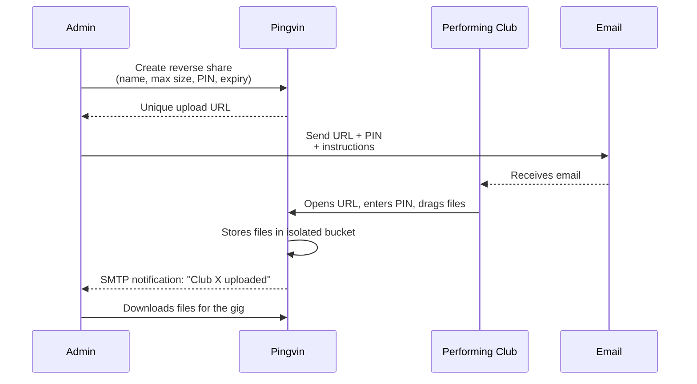

# 03 — Event Operations

The recurring workflow you'll run for every event.

## Workflow per event



## 1. Create reverse shares (20 × ~1 minute)

For each performing club:

1. Log in as admin at <https://multikulti-2026.kud-mladost.org>.
2. Top-right → **New Reverse Share**.
3. Fill in:
   - **Description**: `<Club name> — Multikulti 2026 audio upload`
   - **Max share size**: `200 MB`
   - **Max use count**: `5` (prevents a leaked link from being abused)
   - **Expiration**: day after the event
   - **Password**: generate a 6-digit PIN
4. Click **Create**. Copy the link.
5. Track everything in a spreadsheet:

| Club | Contact email | Upload URL | PIN | Status |
|---|---|---|---|---|
| Tanzclub Wien | maria@... | https://.../share/abc | 421337 | sent |
| Folklore Graz | … | … | … | sent |

> Tip: keep this spreadsheet in 1Password / Bitwarden, not in plain text.

## 2. Email template (DE)

```
Betreff: Multikulti 2026 — Bitte Eure Auftritts-Audiodateien hochladen

Hallo <Vorname>,

vielen Dank, dass Ihr bei Multikulti 2026 auftretet!

Bitte ladet die Audiodateien für Euren Gig bis spätestens
<Datum, z. B. 14 Tage vor dem Event> über folgenden Link hoch:

🔗 <UPLOAD_URL>
PIN: <PIN>

Hinweise:
• Nur MP3 oder WAV-Dateien
• Max. 30 MB pro Datei, gesamt max. 200 MB
• Dateien bitte in Reihenfolge benennen, z. B.:
  01_intro.mp3
  02_main.mp3
  03_outro.mp3

Bei Fragen einfach auf diese Mail antworten.

Beste Grüße
Dejan
KUD Mladost
```

## 2b. Email template (EN)

```
Subject: Multikulti 2026 — Please upload your performance audio

Hi <First name>,

Thanks for performing at Multikulti 2026!

Please upload your gig audio files by <date> via this link:

🔗 <UPLOAD_URL>
PIN: <PIN>

Notes:
• MP3 or WAV only
• Max 30 MB per file, max 200 MB total
• Please name files in performance order, e.g.:
  01_intro.mp3
  02_main.mp3
  03_outro.mp3

Reply to this email if anything is unclear.

Best,
Dejan
KUD Mladost
```

## 3. Monitor uploads

If you set up SMTP, each upload triggers an email. Otherwise check the
admin panel periodically:

- **Shares** tab → each completed upload appears as a new share
  under the originating reverse share.
- Click a share → **Download all** to get a zip.

## 4. Reminder cycle

About 7 days before the event, log in, check which clubs haven't
uploaded yet, and send a reminder. Pingvin shows the upload count per
reverse share so you can quickly identify gaps.

## 5. Post-event cleanup

After the event:

1. Download all files locally as backup (one zip per club).
2. Optional: archive zips in a private cloud folder.
3. In Pingvin: delete the reverse shares (Shares → trash icon). This
   also deletes the uploaded files from disk.

Or, even simpler: see
[05 — Teardown and Restore](05-teardown-and-restore.md) to snapshot
and destroy the VPS entirely until the next event.

## Operating it without you

The day-to-day tasks (create reverse share, check uploads, download
files) are all point-and-click in the Pingvin admin panel. Any
non-technical club member who has the admin login can do them. They
never need SSH, Terraform, or the command line.

What they cannot do (and shouldn't need to):

- Update the platform → you run `scripts/update.sh` (see
  [04 — Maintenance](04-maintenance.md))
- Restore from a backup
- Change the domain or SSL config

Next: [04 — Maintenance](04-maintenance.md).
