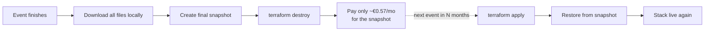

# 05 — Teardown and Restore (Save Money Between Events)

If you only run one event a year, you can stop paying for the VPS
between events. The strategy:



## Pausing the platform after an event

### 1. Download all files locally

Use the admin UI: for each reverse share, click **Download all**.
Archive the zips in your private storage.

### 2. Take a final snapshot

The snapshot preserves Pingvin's data, config, and admin account.
Useful if you want exact continuity next time.

```bash
hcloud server create-image multikulti-upload-01 \
  --type snapshot \
  --description "post-multikulti-2026"
```

Note the snapshot ID:

```bash
hcloud image list --type snapshot
```

### 3. Destroy the VPS

```bash
cd terraform
terraform destroy
```

This removes:

- The server (compute charge stops immediately)
- The firewall
- The SSH key in the project
- The Cloudflare DNS records

The snapshot remains (snapshots survive server deletion). Cost going
forward: snapshot storage only, ~€0.57/month for a 40 GB image.

## Resuming for the next event

### Option A — Fresh start (recommended if it's been a year)

Simplest path. Run the full setup again — config is in version control:

```bash
cd terraform
terraform apply
```

You'll get a new server, new admin account on first visit, and the
clean slate is probably what you want for a new event anyway (different
clubs, different reverse-share lifecycle).

### Option B — Restore the old snapshot

If you specifically want the old admin account, previous shares, etc.:

1. Find the snapshot ID:
   ```bash
   hcloud image list --type snapshot
   # note the ID, e.g. 12345678
   ```

2. Edit `terraform/main.tf`, change the `hcloud_server.app` block:
   ```hcl
   resource "hcloud_server" "app" {
     # ...
     image = "12345678"   # snapshot ID instead of "ubuntu-24.04"
     # IMPORTANT: comment out the user_data line, or it will re-run cloud-init
     # user_data = local.cloud_init
   }
   ```

3. `terraform apply`. The new VPS boots from the snapshot — Pingvin and
   all data are already there. Cloudflare DNS gets a new IP, propagated
   in ~30 seconds.

4. After verifying the restore works, revert `main.tf` (`image =
   var.server_image`, uncomment `user_data`) so future deploys are
   clean again.

> The cleaner long-term pattern is to keep the OS image fresh and
> restore only `/srv/pingvin/data` from a `restic` or `tar` backup.
> For a once-a-year hobby use case, the snapshot approach is fine.

## Full destruction (the platform is no longer needed)

```bash
# 1. Destroy infrastructure
cd terraform
terraform destroy

# 2. Delete the final snapshot (optional, if you don't want to pay for it)
hcloud image list --type snapshot
hcloud image delete <id>

# 3. Revoke the Hetzner and Cloudflare API tokens
#    (Hetzner console → Security → API tokens)
#    (Cloudflare dashboard → My Profile → API Tokens)
```

After this, your monthly cost is €0.

Next: [06 — Troubleshooting](06-troubleshooting.md).
