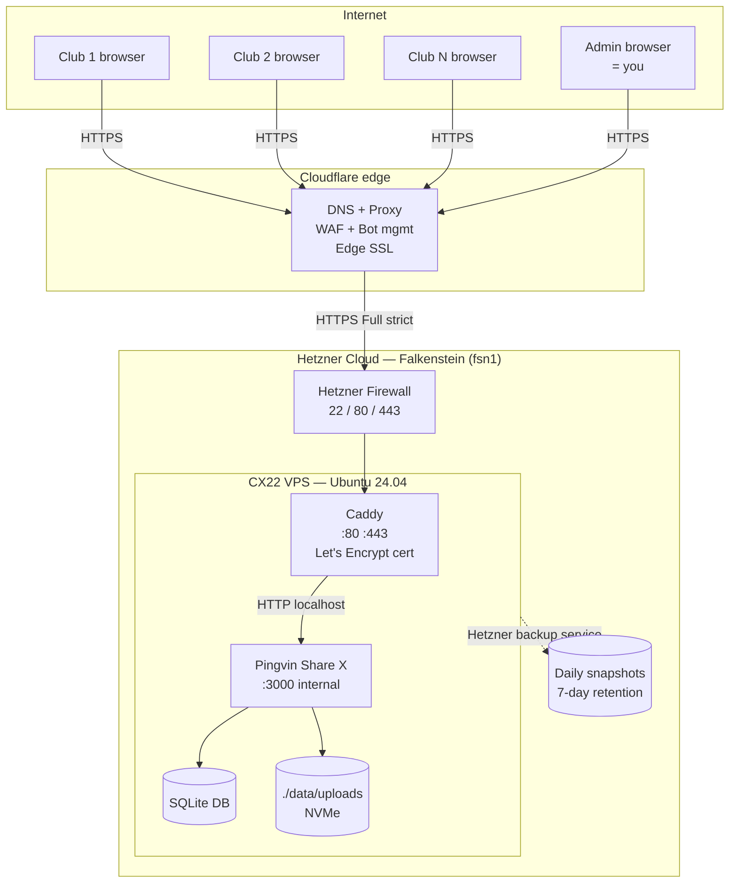
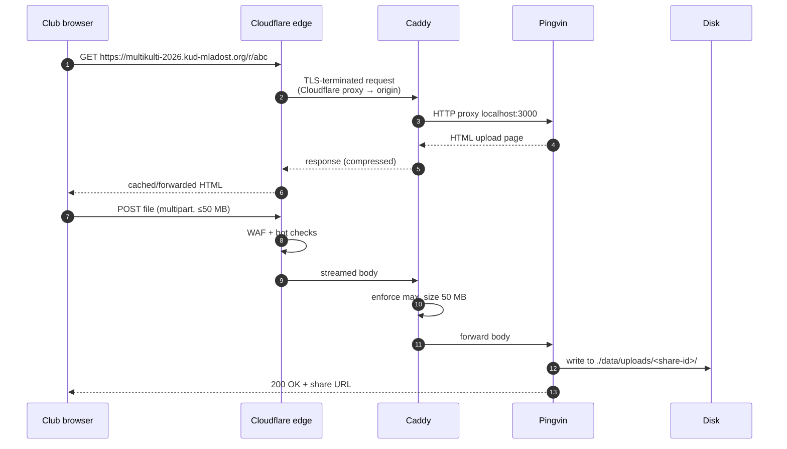
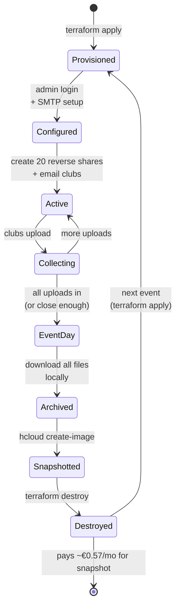
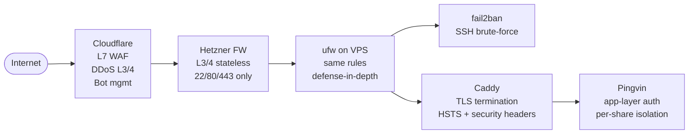

# Architecture

## System overview



## Network flow on a single upload



## Lifecycle for one event



## Data layout on the VPS

```
/srv/pingvin/
├── docker-compose.yml      # Caddy + Pingvin services
├── Caddyfile               # reverse-proxy config
└── data/                   # ← persistent volume (the only thing that matters for backup)
    ├── pingvin.sqlite      # accounts, shares, reverse-share configs
    ├── uploads/
    │   ├── <share-id-1>/   # one folder per share (created on each upload)
    │   │   ├── 01_intro.mp3
    │   │   └── 02_main.mp3
    │   └── <share-id-2>/
    └── images/             # logos, custom assets

/var/log/caddy/access.log   # access log, rotated at 10 MiB × 5 files
```

## Security boundaries



Layered defense: every step trims attack surface. Even if Cloudflare's
proxy is bypassed (someone resolves the origin IP), the Hetzner firewall
+ ufw still limit traffic to web ports, fail2ban catches SSH brute force,
and Pingvin's auth model means an attacker still can't see other clubs'
files without their unique URL + PIN.
